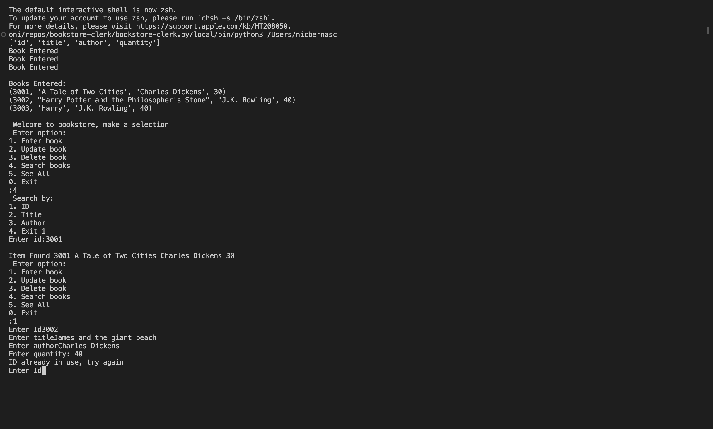

# bookstore-clerk

## Description 
The Bookstore Clerk is a Python program designed to simulate a bookstore database using SQLite. The store is assigned to a database class, and methods are operated within the class. Users can add, delete, search, and update books. Defensive coding techniques are employed to catch invalid user entries.

## Screen Shot

This is a demo screen shot of the program in use. 

